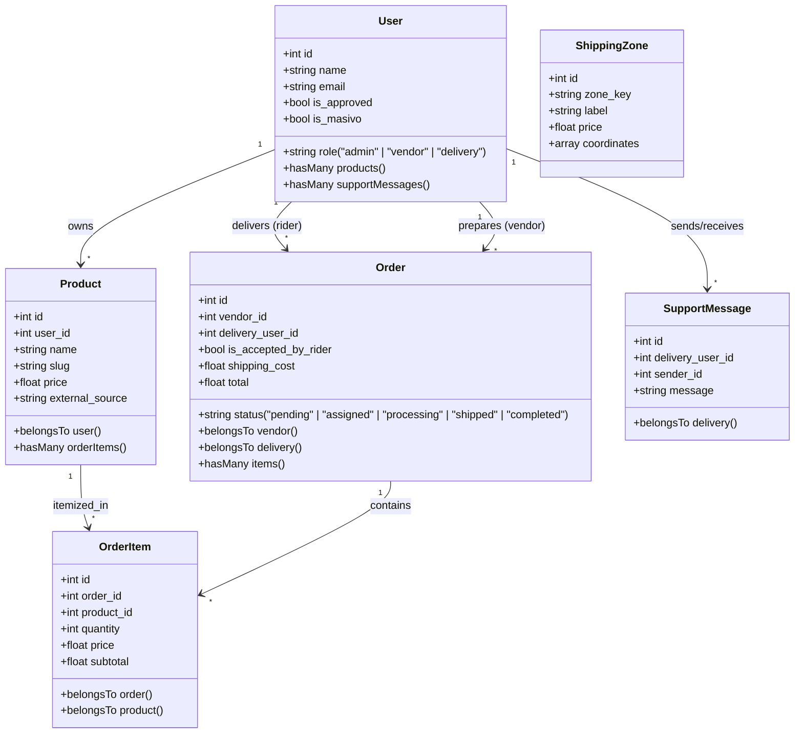
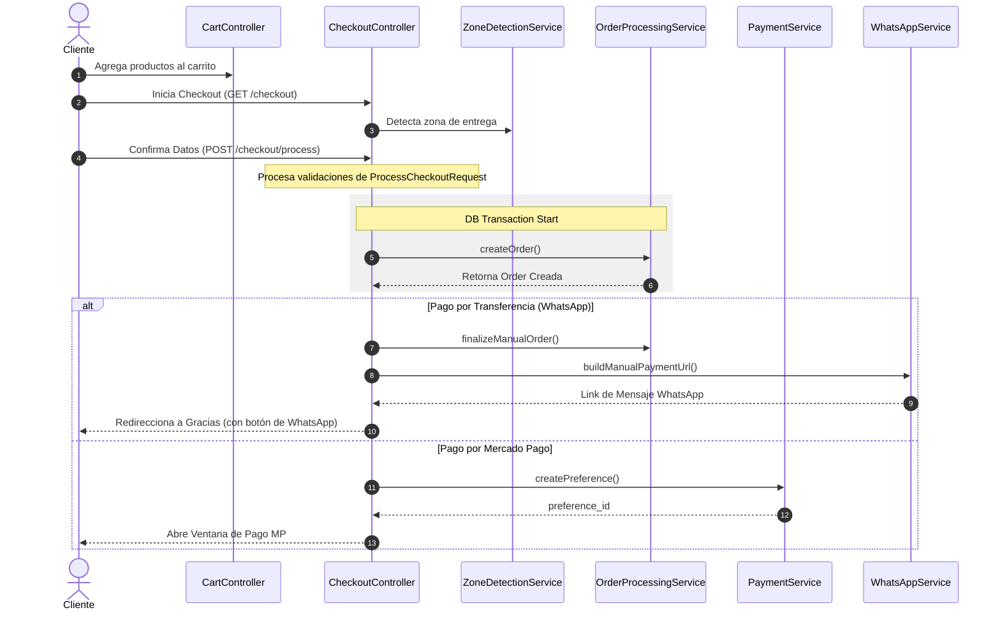
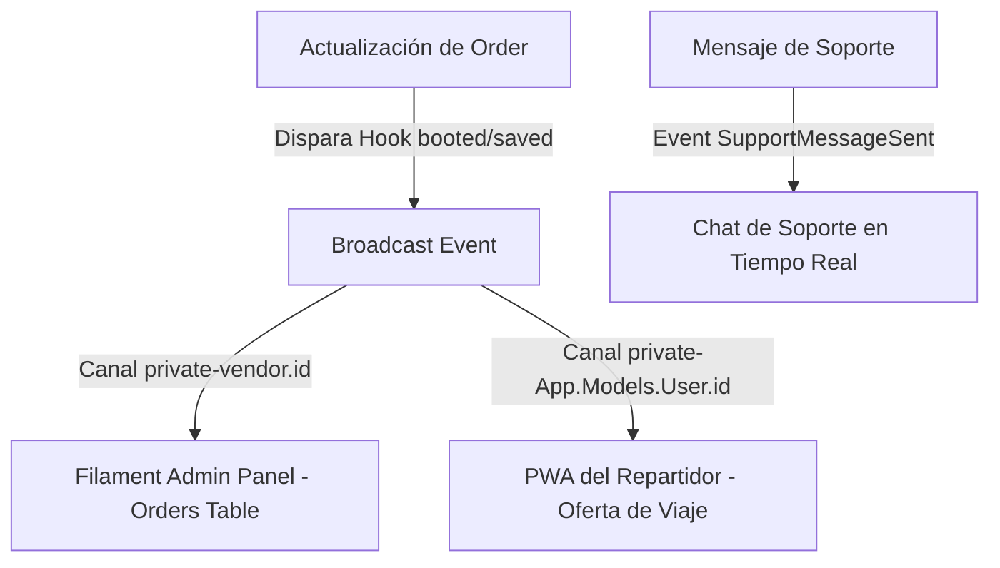

# Mapa de Arquitectura del Proyecto Dino

Este documento describe la arquitectura técnica del proyecto Dino utilizando diagramas de **Mermaid.js**. Estos diagramas ilustran las relaciones entre modelos, el flujo del proceso de Checkout y la comunicación en tiempo real.

---

## 🗺️ Mapa de Relaciones de Modelos (Entity-Relationship)

---

## ⚡ Ciclo de Vida del Pedido y Transacciones (Checkout)

Flujo secuencial que detalla las interacciones del controlador y los servicios de negocio al procesar un pedido:

---

## 🔌 Notificaciones y Websockets (Tiempo Real)

